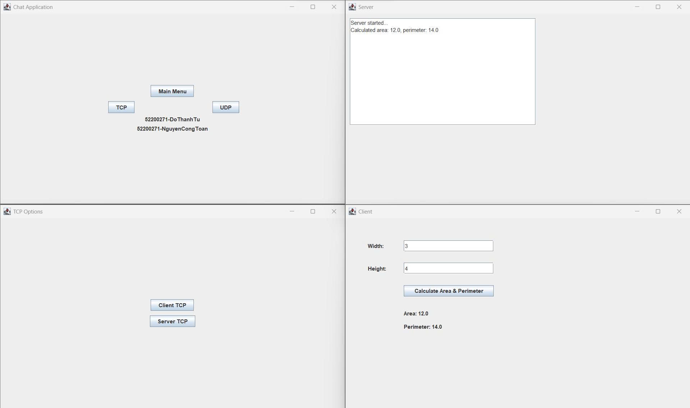
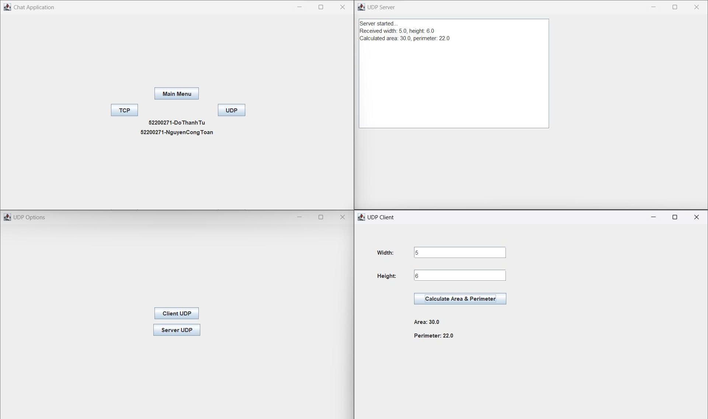

# 📐🔶 Tính Diện Tích & Chu Vi Hình Chữ Nhật - Mô Hình Client-Server TCP/UDP

## 📝 Giới thiệu

Ứng dụng này minh họa mô hình client-server sử dụng cả giao thức **TCP** và **UDP** để tính diện tích, chu vi hình chữ nhật.  
Người dùng nhập chiều dài, chiều rộng trên **Client GUI** → gửi lên **Server** tính toán → nhận kết quả trả về.

## 🚀 Tính năng chính

- Hỗ trợ giao thức **TCP** & **UDP**
- Có giao diện đồ hoạ (Java Swing) cho cả client và server
- Xem lịch sử giao dịch trên cửa sổ server

## 🏗️ Kiến trúc tổng quan

- **Client**: Nhập dữ liệu, gửi về server, nhận và hiển thị kết quả
- **Server**: Nhận dữ liệu, tính toán diện tích & chu vi, gửi kết quả về cho client
- Hỗ trợ chọn TCP hoặc UDP từ menu chính

## 🖼️ Ảnh minh họa

<p align="center">
  
  <br><i>Chương trình chạy bằng TCP</i>
</p>

<p align="center">
  
  <br><i>Chương trình chạy bằng UDP</i>
</p>

## 🗂️ Cấu trúc thư mục

```
File.java/
 └─ antoanmang/
      ├─ ClientTCP.java
      ├─ ClientUDP.java
      ├─ ServerTCP.java
      ├─ ServerUDP.java
      └─ mains.java
Image/
  ├─ h1.jpg        # Ảnh minh hoạ TCP
  └─ h2.jpg        # Ảnh minh hoạ UDP
README.md
```

## ⚙️ Hướng dẫn sử dụng

### Yêu cầu

- Java 8 trở lên
- Có thể dùng Eclipse/IntelliJ/Netbeans hoặc chạy bằng dòng lệnh

### Chạy chương trình

**A. Bằng IDE:**  
- Mở/mount project vào IDE  
- Chạy file `mains.java`  
- Chọn giao thức (TCP/UDP) và vai trò (Client hoặc Server), mỗi app một cửa sổ riêng

**B. Bằng terminal (command line):**
```bash
cd File.java/antoanmang
javac *.java
# Server TCP:
java antoanmang.ServerTCP
# Client TCP:
java antoanmang.ClientTCP
# Server UDP:
java antoanmang.ServerUDP
# Client UDP:
java antoanmang.ClientUDP
```
**Lưu ý:**  
- Chạy server trước, rồi tới client.
- Mặc định sử dụng localhost, port 12345.

## 💡 Cách hoạt động

1. Server hiển thị log kết quả khi nhận, tính diện tích/chu vi và gửi lại client.
2. Client nhập width, height, nhấn nút “Calculate Area & Perimeter” để nhận kết quả từ server.
3. Giao diện đơn giản, trực quan.

## 🏆 Công nghệ sử dụng

- Java Swing (GUI)
- Java Socket (TCP & UDP)
- Java AWT/Swing

## 👤 Tác giả

- Szero-White

---

🎉 **Chúc bạn học tốt lập trình mạng và socket!**
